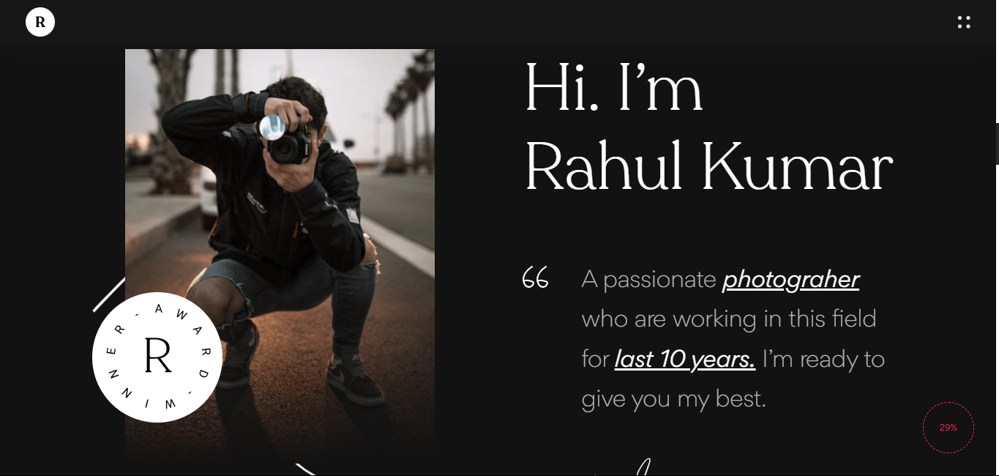

  <h2 align="center">Rahul KUmar- Photographer Portfolio Website</h2>

  Rahul kumar is a fully responsive portfolio website, <br />Responsive for all devices, build using HTML, CSS, and JavaScript.

  <a href="https://shivamseamar.github.io/Rahul_Kumar_Photographer/"><strong>➥ Live Demo</strong></a>

</div>

<br />

### Demo Screeshots



### Prerequisites

Before you begin, ensure you have met the following requirements:

* [Git](https://git-scm.com/downloads "Download Git") must be installed on your operating system.

### Run Locally

To run **Rahul Kumar** locally, run this command on your git bash:

Linux and macOS:

```bash
sudo git clone 
```

Windows:

```bash
git clone 
```

### Contact

If you want to contact with me you can reach me at [LikedIn](https://www.linkedin.com/in/shivamseamar25/).

### License

